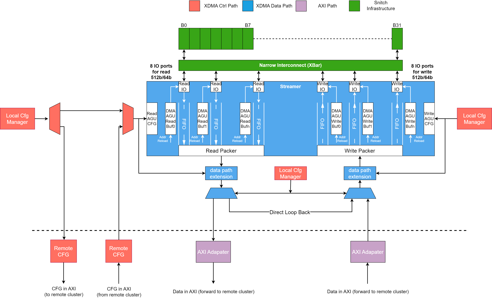
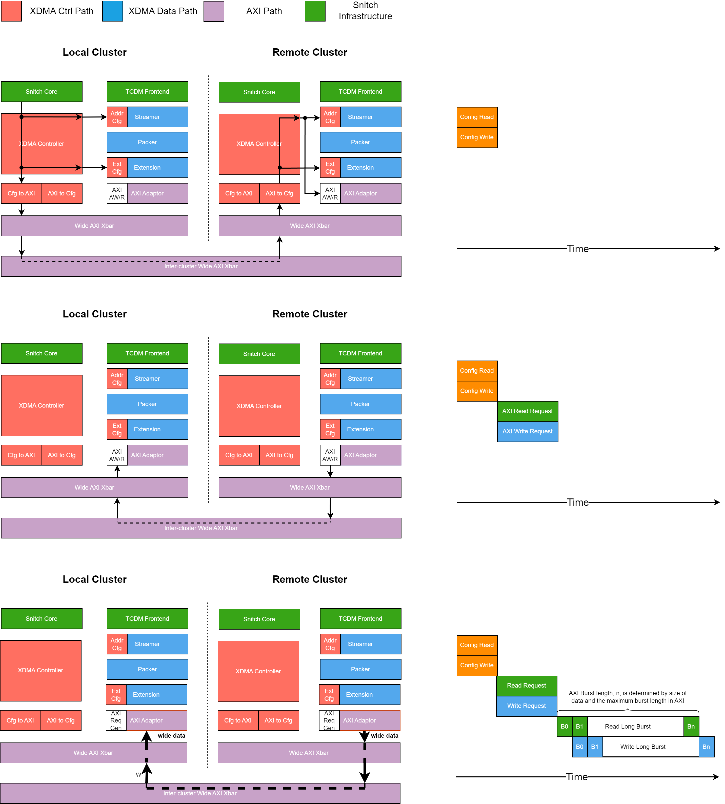

# Snax Cluster eXtendable Distributed Memory Access (XDMA)

This documentation introduces the Extendable Distributed Memory Access (XDMA), a system designed for widespread use in Snax clusters, facilitating both intra-cluster and inter-cluster *Computation on Copy (CoC)*. The documentation covers the following aspects:

- [Snax Cluster eXtendable Distributed Memory Access (XDMA)](#snax-cluster-extendable-distributed-memory-access-xdma)
  - [Introduction and XDMA hardware block diagram](#introduction-and-xdma-hardware-block-diagram)
  - [Source Code Hierarchy](#source-code-hierarchy)
  - [Features](#features)
    - [New Data-fetching Unit (Streamer) to Support Powerful Direct Memory Access](#new-data-fetching-unit-streamer-to-support-powerful-direct-memory-access)
    - [Extendable Datapath Extension to Enable *Computation on Copy* Capability](#extendable-datapath-extension-to-enable-computation-on-copy-capability)
    - [Distributed Datapath for Cluster-to-Cluster or Host-to-Cluster Memory Access](#distributed-datapath-for-cluster-to-cluster-or-host-to-cluster-memory-access)
  - [CSR Address Definition](#csr-address-definition)
  - [Design of Custom Datapath Extension](#design-of-custom-datapath-extension)
    - [Native Datapath Extension](#native-datapath-extension)
    - [SystemVerilog Datapath Extension](#systemverilog-datapath-extension)
  - [Integration with SNAX Platform](#integration-with-snax-platform)
    - [Hardware Interface](#hardware-interface)
    - [Software Interface](#software-interface)


## Introduction and XDMA hardware block diagram

XDMA is implemented in every cluster with the following architecture:



At the top of the diagram is the interface to the TCDM. IO operations towards local memory occur here. The interface consists of multiple channels accessing data in parallel. The Address Generation Unit generates addresses consumed by each channel. The accessed data is forwarded to XDMA datapath extension chains, undergoing several programmable processes. The data is either looped back to the writer side of the same XDMA if the destination is in the same region as the source, or sent to the writer side of a remote XDMA if in a different region. The writer's side mirrors the reader's side but inverts the data flow direction.

## Source Code Hierarchy

Root directory: ***snax_cluster/hw/chisel/src/main/scala/snax
/xdma/***

> - **CommonCells**
>   - **ComplexQueue.scala**: A FIFO supporting multiple input, single output or single input, multiple output configurations with internal concatenation.
>   - **CustomOperators.scala**: The custom operator to support the concatenation of UInt and insertion of pipeline registers.
>   - **MuxDemuxDecoupled.scala**: Mux and Demux for decoupled signals with Valid/Ready handshaking.
> - **DesignParams**
>   - **DesignParams.scala**: Classes related to design parameters.
> - **xdmaExtension**
>   - **DMAExtension.scala**: Abstract base module for all DMA Extensions. All XDMA Extensions should extend from the base module declared in this file.
>   - **MaxPool.scala**: Implementation of MaxPool Extension.
>   - **Memset.scala**: Implementation of Memset Extension, allowing memory set operations other than zero. 
>   - **Transposer.scala**: Implementation of matrix-transpose Extension for INT8 matrices. 
> - **xdmaFrontend**
>   - **DMACtrl.scala**: Controls the XDMA, managing configuration forwarding to or from remote sites.
>   - **DMADataPath.scala**: Datapath of XDMA where instantiation of streamers and datapath extensions occur.
> - **xdmaStreamer**
>   - **AddressGenUnit.scala**: Address generation unit for all channels with configurable buffer sizes for generated addresses.
>   - **DataRequestor.scala**: Module generating requests to the TCDM interface.
>   - **DataResponser.scala**: Module receiving responses from the TCDM interface.
>   - **Reader.scala**: Reads data from the TCDM, incorporating both a **DataRequestor** and a **DataResponser**.
>   - **Writer.scala**: Writes data to the TCDM, incorporating a **DataRequestor**.
> - **xdmaTop**
>   - **xdmaTop.scala** The top module and entry point of the entire Scala (Chisel) program, acting as a SystemVerilog Generator.

## Features

This section introduces three key features of XDMA:

### New Data-fetching Unit (Streamer) to Support Powerful Direct Memory Access

The TCDM interconnect at the top of the figure provides full-region data access with a one-cycle delay if there is no contention. XDMA's configuration includes variable bit widths for both memory and AXI channels. The number of data streamers on both reader and writer sides is automatically determined by these configurations, e.g.,:

- **TCDMDataWidth=64** and **AXIDataWidth=512**: Typical for Snax clusters. XDMA will instantiate eight channels for both reading and writing at the TCDM side, concatenating them into a single 512-bit channel at the AXI side.
- **TCDMDataWidth=64** and **AXIDataWidth=64**: Typical for global scratchpad memory/SRAM. XDMA will instantiate only one channel on each side, adopting a simpler architecture used by most other DMAs.

Each TCDM channel has its own address and data caches, enabling independent data fetching with minimal interference from other channels. Channels can be selectively disabled if the required bandwidth is less than the bandwidth of all channels combined (e.g., turning off all reader channels and enabling writer channels to write zeros to memory). Additionally, a byte mask is also implemented for byte-level granularity in writing the data back to memory.

Data from the streamer is concatenated into a wide bus and forwarded to the datapath extension.

### Extendable Datapath Extension to Enable *Computation on Copy* Capability

The Datapath Extension is a critical component allowing on-the-fly data processing such as matrix transposing, max-pooling, average-pooling, and data stream compression/decompression. By supplying the necessary parameters to the XDMA generator, extension modules are instantiated sequentially, with each module's output feeding into the next module's input.

Designing a custom datapath extension is straightforward thanks to Chisel's flexibility. The pipeline is automatically inserted, CSR configs are automatically wired, infrastructure for enabling/disabling extensions is added, and the corresponding C header for runtime is automatically generated. Integrating native extensions written in Chisel or extensions written in SystemVerilog is remarkably simple.

### Distributed Datapath for Cluster-to-Cluster or Host-to-Cluster Memory Access

XDMA can perform data copying within the same memory region or across different regions. If the source and destination addresses are from the same region, data is looped back directly without utilizing the AXI, conserving energy. If addresses span different regions, the data is handled in three steps:
1. The controller recognizes that the source data is from a non-local region and flattens the configuration into a one-dimensional frame with a width equal to the bitwidth of the AXI bus.
2. The configuration frame is sent to the remote XDMA to request the data.
3. The data is relayed back from the remote to the local site.

An illustration of the XDMA call chain is shown below:



Note: The AXI protocol adaptor is still under development and the architecture may change.

## CSR Address Definition

Consider the following configuration:

```hjson
// Key configuration items only:

  // CFG items inside cluster
  cluster: {
    addr_width: 48,
    data_width: 64,
    dma_data_width: 512
  },
  // CFG items inside XDMA core template
  xdma_core_template: {
     snax_xdma_cfg: {
         reader_buffer: 8, 
         writer_buffer: 8, 
         reader_agu_dimension: 3, 
         writer_agu_dimension: 3, 
         HasTransposer: 3, 
         HasMemset: 1, 
         HasMaxPool: 2
     }
  }
```

This configuration specifies eight channels for both reader and writer TCDM ports, employing three-dimensional address generation. The innermost dimension is used explicitly by the eight parallel channels, and its value can be reduced to disable some channels. The other two dimensions are managed by the Address Generation Unit (AGU).

The enabled extensions — **HasTransposer**, **HasMemset**, and **HasMaxPool** — add bypass signals and custom CSRs to the configuration list. The positive number at the back means it will be enabled, and the size of the number indicate its sequence - the one with smaller value will in the front of one with larger value. 

The following table outlines the CSR addresses and their settings:


| CSR Address | Privilege |                Description               |      Effective Bits / Value      |
|:-----------:|:---------:|:----------------------------------------:|:--------------------------------:|
|     960     |     RW    |      The LSB of Source Base Address      |              [31:0]              |
|     961     |     RW    |      The MSB of Source Base Address      |              [15:0]              |
|     962     |     RW    |       Spatial Bound at Source side       |     0, 1, 2, 3, 4, 5, 6, 7, 8    |
|     963     |     RW    |    Temporal Bound (D1) at Source side    |              [15:0]              |
|     964     |     RW    |    Temporal Bound (D2) at Source side    |              [15:0]              |
|     965     |     RW    |       Spatial Stride at Source side      |              [31:0]              |
|     966     |     RW    |    Temporal Stride (D1) at Source side   |              [31:0]              |
|     967     |     RW    |    Temporal Stride (D2) at Source side   |              [31:0]              |
|     968     |     RW    |    The LSB of Destination Base Address   |              [31:0]              |
|     969     |     RW    |    The MSB of Destination Base Address   |              [15:0]              |
|     970     |     RW    |     Spatial Bound at Destination side    |     0, 1, 2, 3, 4, 5, 6, 7, 8    |
|     971     |     RW    |  Temporal Bound (D1) at Destination side |              [15:0]              |
|     972     |     RW    |  Temporal Bound (D2) at Destination side |              [15:0]              |
|     973     |     RW    |    Spatial Stride at Destination side    |              [31:0]              |
|     974     |     RW    | Temporal Stride (D1) at Destination side |              [31:0]              |
|     975     |     RW    | Temporal Stride (D2) at Destination side |              [31:0]              |
|     976     |     RW    |  Byte Mask (Strobe) at Destination side  |               [7:0]              |
|     977     |     RW    |    Bypass Enabler of  Memset Extension   |               0, 1               |
|     978     |     RW    |        Memset Extension Custom CSR       |               [7:0]              |
|     979     |     RW    |    Bypass Enabler of MaxPool Extension   |               0, 1               |
|     980     |     RW    |       MaxPool Extension Custom CSR       |               [7:0]              |
|     981     |     RW    |   Bypass Enabler of Transpose Extension  |               0, 1               |
|     982     |     RW    |       Commit Current Configuration       |                 1                |
|     983     |     R     |      Committed Configuration Counter     |              [31:0]              |
|     984     |     R     |      Finished Configuration Counter      |              [31:0]              |

Offsets may vary based on the configuration, but the Chisel code will automatically generate the necessary C headers, ensuring ease of use for developers.

## Design of Custom Datapath Extension

### Native Datapath Extension

Designing a Datapath Extension involves four steps:

1. Define the instantiation object by extending **HasDMAExtension**: 

```scala
object HasTransposer extends HasDMAExtension {
  implicit val extensionParam: DMAExtensionParam = new DMAExtensionParam(
    moduleName = "Transposer",
    userCsrNum = 0,
    dataWidth = 512
  )

  def instantiate(clusterName: String): Transposer = Module(new Transposer {
    override def desiredName = clusterName + namePostfix
  })
}
```

This code segment defines a variable to provide XDMA with the necessary information about the module name, data width, and number of custom CSRs. It also defines a method to handle the actual hardware module instantiation.

2. Implement the extension by extending **DMAExtension**:

```scala
class Transposer()(implicit extensionParam: DMAExtensionParam)
    extends DMAExtension {

  require(
    extensionParam.dataWidth == 512 && 512 == extensionParam.dataWidth,
    "transposeInWidth must be 512 for now"
  )

  // fixed pattern: transpose 8x8 matrix
  val out_data_array = Wire(Vec(8, Vec(8, UInt(8.W))))

  for (i <- 0 until 8) {
    for (j <- 0 until 8) {
      out_data_array(i)(j) := ext_data_i.bits(
        i * 8 + j * 8 * 8 + 7,
        i * 8 + j * 8 * 8 + 0
      )
    }
  }
  ext_data_i.ready := ext_data_o.ready
  ext_data_o.valid := ext_data_i.valid
  ext_busy_o := false.B
  ext_data_o.bits := out_data_array.asUInt
}
```
This code extends the **DMAExtension**, setting up the necessary signal interactions. Notably, **ext_data_i** and **ext_data_o** manage data input and output respectively, both as Decoupled signals facilitating flow control. The **ext_busy_o** signal indicates the operational status of the extension. **ext_csr_i** represents an input vector signal, whose length matches the userCsrNum specified in the instantiation object.

Do not forget the second bracket ***(implicit extensionParam: DMAExtensionParam)*** as mentioned in the code - this is used to convey the information so that the module is correctly generated. The first bracket, on the other hand, is reserved for users to do parameter passing. For this Transpose module, no parameter needs to be passed, so it is an empty bracket. 

3. Systematically Test the DMAExtension by extending the **DMAExtensionTester**:

The infrastructure is provided to do the test of designed DMAExtension before integration by extending **DMAExtensionTester**: 

```scala
class TrasnposerTester extends DMAExtensionTester {
  def hasExtension = HasTransposer  //The instantiation object
  val csr_vec = Seq()               // No csr needed
  val input_data_vec = Seq(...)     // The input of extension
  val output_data_vec = Seq(...)    // The expected output of extension
}
```

Running this testbench allows developers to verify the extension's functionality and debug any issues using waveform analysis. The test passes if the module's output matches the expected values.

### SystemVerilog Datapath Extension

To be developed

## Integration with SNAX Platform

### Hardware Interface

The hardware interface connects similarly to streamer interfaces on the SNAX platform. The connection is managed via a wrapper generated from a Mako template located at **hw/templates/snax_xdma_wrapper.sv.tpl**. This approach resembles how an accelerator connects within the Snitch cluster, with plans to replace original DMA cores when the AXI port is completed.

### Software Interface

The runtime software is located at ***target/snitch_cluster/sw/snax/xdma***; example software can be found at ***target/snitch_cluster/sw/apps/snax-xdma-memset***. This example demonstrates how XDMA with the Memset Extension performs various memory operations and is recommended for getting started with software integration.
